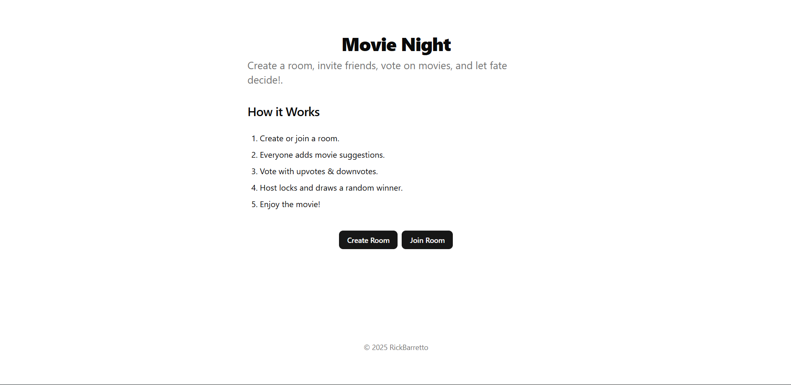
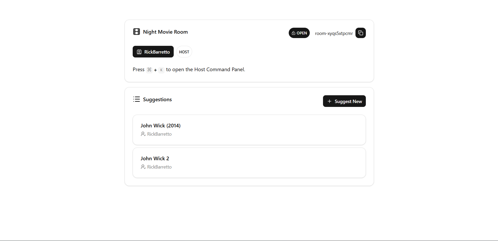

# Movie Night

Small webapp where friends can decide which movie to watch. This is a PBL project for the Imersão42 2025ed technical challenge to learn and test abilities on fullstack development.

Challenge Link: [Imersão42 2025 Fullstack challenge](https://gist.github.com/talyssonoc/a47b1598955461cf500ad2ea58ab2cc8)

## Design Decisions

### Challenge

This does not stricly follow any architecture design,
but allows me to update to a more robust architecture.

I've decided to not use Clean Architecture because the project is too small
for this. But this is totally possible and easy to migrate.
I also don't have any persistency because of time short deadline,
so I implemented in-memory storage. This doesn't mean that this storage
is useless, it can be used for testing purposes or as a temporary solution,
but it's not recommended for production use.

### Post-Challenge

I could improve the UI/UX, add more features, and refactor the codebase.
Add persistency, cache, and clean architecture.

## TODO

### Project

- [ ] Login/Signup feature (via JWT)
- [ ] Host allowed to refuse movies
- [x] Room Permalink

### Backend

- [ ] Use cases
- [ ] Persistency on PostgreSQL
- [ ] Websockets for update the UI
- [ ] Redis for caching
- [ ] Dockerize the application

### Frontend

- [ ] Unit & Integration tests
- [ ] End-to-end tests
- [ ] Feedback Page
